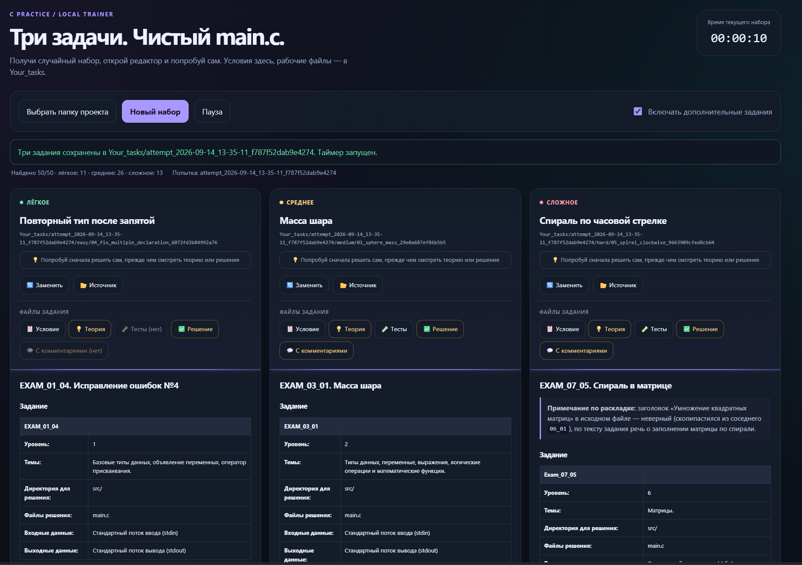
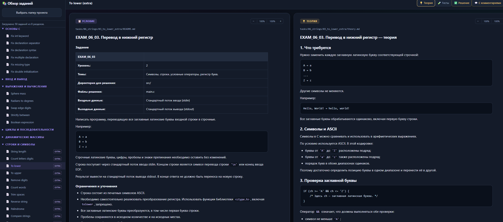

<div align="center">

# 🎯 Тренажёр по C

**50 заданий** для подготовки к экзамену по C в Школе 21

Исправление ошибок · Ввод-вывод · Циклы · Массивы · Строки · Матрицы · Структуры

</div>

---

## 📸 Как это выглядит

### 🎲 Тренажёр — случайный набор из трёх заданий

<div align="center">
  
</div>

Выбираешь папку проекта → нажимаешь «Новый набор» → получаешь три задания разного уровня сложности. Условия открываются прямо на странице, а рабочие файлы (пустой `main.c` + копия условия) создаются в `Your_tasks/`.

### 📖 Обзор — все задания в одном месте

<div align="center">
  
</div>

Дерево слева, содержимое справа. Клик на задание — сразу видно условие. Клик на 💡 Теорию, ✅ Решение или 🧪 Тесты — экран делится на две части, чтобы можно было сравнивать одновременно.

---

## 🗂 Что внутри

| Раздел | Темы | Заданий |
| --- | --- | ---: |
| [Основы C](tasks/01_basics/) | Типы данных, переменные, исправление ошибок | 6 |
| [Ввод и вывод](tasks/02_input_output/) | `scanf`, `printf`, форматирование, экранирование | 5 |
| [Выражения и вычисления](tasks/03_expressions/) | Формулы, округление, цифры и логика | 5 |
| [Циклы и последовательности](tasks/04_loops/) | Поиск максимума, обработка чисел, число без пары | 5 |
| [Динамические массивы](tasks/05_dynamic_arrays/) | Память, порядок элементов, удаление повторов | 4 |
| [Строки и символы](tasks/06_strings/) | Регистр, пробелы, слова, палиндромы, шифр Цезаря | 14 |
| [Матрицы](tasks/07_matrices/) | Сложение, умножение, перестановки, поворот, спирали | 6 |
| [Структуры](tasks/08_structures/) | Работа со `struct`, `malloc`, сортировка, фильтрация | 5 |
| **Итого** | | **50** |

Это **не официальный список экзаменационных заданий**. Цель — разобраться в основных приёмах и научиться писать небольшие программы самостоятельно.

### Что означает `_extra`

Папки с суффиксом `_extra` (например, `06_count_words_extra`) — дополнительные тренировочные задания.

Они составлены для практики и **не являются подтверждёнными**: могут не быть на экзамене или встретиться в другом виде. Отсутствие `_extra` тоже не гарантирует, что задание попадётся именно так.

---

## 📁 Как устроено задание

Каждое задание живёт в отдельной папке:

| Файл | Что в нём |
| --- | --- |
| `README.md` | Условие, ограничения и примеры |
| `main.c` | Место для твоего решения (пустой) |
| `theory.md` | Объяснение алгоритма и нужных конструкций C |
| `tests.md` | Тесты с ожидаемыми ответами и командами запуска |
| `solution.c` | Эталонное решение |
| `solution_commented.c` | То же решение с подробными комментариями |

> В разделах `01_basics` и `02_input_output` тесты и комментированные решения пока есть не у всех заданий — там задачи простые.

---

## 🚀 Как заниматься

1. Открой условие выбранного задания (или запусти [тренажёр](#-инструменты)).
2. Напиши решение в `main.c`.
3. Если застрял — загляни в `theory.md`.
4. Скомпилируй программу и проверь её на примерах и тестах.
5. Сравни свою реализацию с эталоном.

В заданиях **на исправление ошибок** сначала перенеси исходный код из условия в `main.c`.

> Твоё решение не обязано совпадать с эталоном. Главное — правильный результат и соблюдение ограничений.

---

## 🛠 Инструменты

В корне проекта лежат два HTML-файла для удобной работы. Открывать в **Chrome** или **Edge** — нужен доступ к файловой системе.

### 🎲 `trainer.html` — тренажёр случайных заданий

Симулирует экзамен: выбирает по одному заданию из трёх уровней сложности.

1. Открой `trainer.html` в браузере.
2. Нажми **«Выбрать папку проекта»** и укажи корень репозитория.
3. Разреши доступ к файлам.
4. Нажми **«Новый набор»**.
5. Открой созданные файлы в `Your_tasks/` и решай задания в своём редакторе.

Кнопки задания:
- 🔄 **Заменить** — сменить конкретное задание, не трогая остальные
- 📂 **Источник** — показать, откуда взято задание
- 📋 **Условие** · 💡 **Теория** · 🧪 **Тесты** · ✅ **Решение** · 💬 **С комментариями**

Кнопки-спойлеры (теория и решения) выделены жёлтым — напоминание попробовать решить самому.

### 📖 `preview.html` — обзор всех заданий

Каталог всего проекта: дерево слева, содержимое справа.

1. Открой `preview.html`.
2. Нажми **«Выбрать папку проекта»**.
3. Раскрывай разделы и кликай на задания.
4. Правая панель появляется при клике на теорию/тесты/решение — можно менять горизонтальную/вертикальную раскладку кнопкой ⬜.

Идеально, чтобы быстро вспомнить решение или пробежаться по темам перед экзаменом.

---

## ⚙️ Компиляция и запуск

Нужен GCC. Команды рассчитаны на Linux, macOS или WSL.

Перейди в папку задания и собери своё решение:

```bash
gcc -Wall -Wextra -Werror -std=c11 main.c -o main
./main
```

Или сразу передай ввод:

```bash
printf 'level\n' | ./main
```

Собрать эталон отдельно:

```bash
gcc -Wall -Wextra -Werror -std=c11 solution.c -o reference
printf 'level\n' | ./reference
```

> ⚠️ **Не собирай все `.c`-файлы через `*.c`** — каждый содержит свою функцию `main`.

Если задание использует математические функции (`round`, `pow`, `sqrt`, `M_PI`), добавь `-lm`:

```bash
gcc -Wall -Wextra -Werror -std=c11 main.c -o main -lm
```

---

## ✅ Проверка решения

Обращай внимание на пробелы и переносы: **правильное число с неправильным оформлением — тоже ошибка**. Если приглашение терминала появляется сразу после ответа — это нормально для задач без завершающего `\n`.

<details>
<summary><b>Стиль кода</b> — <code>clang-format</code></summary>

```bash
clang-format -n -Werror main.c
```

Автоматически исправить:

```bash
clang-format -i main.c
```
</details>

<details>
<summary><b>Статический анализ</b> — <code>cppcheck</code></summary>

```bash
cppcheck --enable=all --suppress=missingIncludeSystem main.c
```
</details>

<details>
<summary><b>Проверка памяти</b> — <code>valgrind</code></summary>

```bash
gcc -Wall -Wextra -Werror -std=c11 -g main.c -o main
valgrind --leak-check=full --track-origins=yes ./main
```

После запуска введи данные задания. Готовые команды и граничные случаи — в его `tests.md`.
</details>

---

## 📚 Полезное

- [Памятка по C](docs/c_cheatsheet.md) — основные конструкции и частые ошибки
- [Прогресс](docs/progress.md) — шаблон для отметок о пройденных заданиях

---


<div align="center">

**Удачной практики! 🚀**

</div>